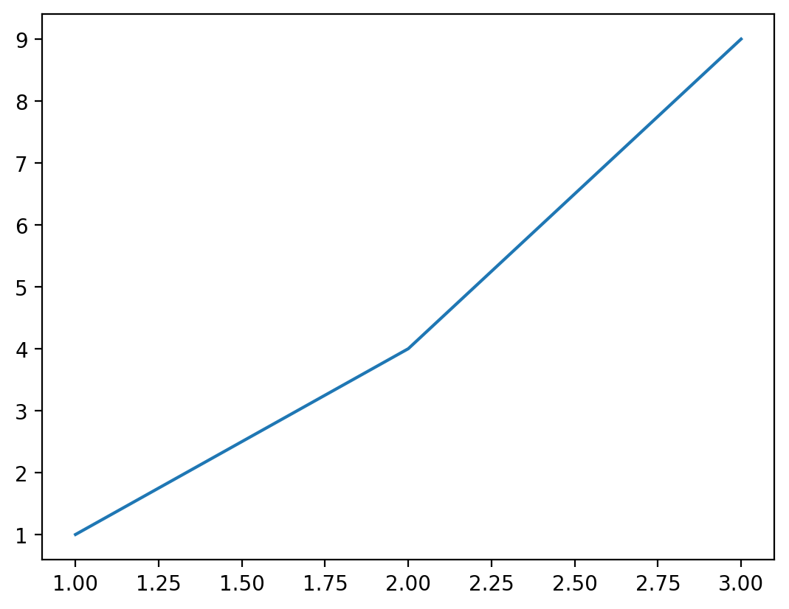

Compliance Pipeline Dashboard
AI-Driven Compliance & Risk Automation for ISO & Data Protection

This project demonstrates how compliance, data protection, and risk monitoring can be automated and visualized with modern tools.
It’s designed to help risk/compliance professionals move from manual Excel reporting to automated dashboards that deliver real-time insights.

Features

Automated ETL Pipeline – Extracts compliance metrics and saves results to CSV.
Risk & Compliance KPIs – Generates ISO 27001/27701 readiness and distribution charts.
Streamlit Dashboard – Interactive web app for executives with KPI cards and trendlines.
Email Notifications – (placeholder) ready for integration with Microsoft Graph API.
Modular Design – Extendable for ISO 42001, GDPR Article 22, NIST AI RMF monitoring.
#  Compliance & Risk Dashboard

An interactive dashboard for tracking **compliance KPIs, risks, and AI audit alignment**.  
Built with **Streamlit, Pandas, and Plotly** — deployed seamlessly on Streamlit Cloud.

---

## Live Demo  
 [Launch the Dashboard](https://YOUR-STREAMLIT-DEPLOYMENT-LINK)  

---
A Streamlit app to monitor DSAR SLA, risk heatmap, and ISO 42001 / NIST AI RMF alignment.

## Preview


## Run locally
```bash
pip install -r requirements.txt
streamlit run streamlit_app.py
##  Screenshots  
### Dashboard Overview  
  

### Risk Heatmap  
  

---

##  Features
-  KPI tracking (Completed, In Progress, Delayed, Not Started)  
-  Risk heatmap by owner × score  
-  Donut chart for controls coverage  
-  Breach callout (high-priority alerting)  
-  Export filtered data to CSV  
-  Cached loaders for speed  

---

## 🗂 Project Structure
compliance-pipeline/
│── data/
│ ├── sample_kpis.csv # Demo KPI dataset
│── streamlit_app.py # Entry point for Streamlit
│── dashboard.py # Visualization components
│── requirements.txt # Python dependencies
│── runtime.txt # Python runtime version
│── README.md # Project documentation


---

## ⚙️ Installation (Local Run)
```bash
# Clone the repo
git clone https://github.com/22Ifeoma22/compliance-pipeline.git
cd compliance-pipeline

# Install dependencies
pip install -r requirements.txt

# Run the app
streamlit run streamlit_app.py
 Sample Data

data/sample_kpis.csv

Owner	Status	Score
Risk	Complete	95
Compliance	In Progress	70
Legal	Delayed	55
IT	Not Started	30
Audit	Complete	90
Governance	In Progress	65

🛠 Tech Stack

Streamlit
 – App framework

Pandas
 – Data handling

Plotly
 – Interactive charts

 Next Improvements

 Add trend lines for KPI progression

Email/Slack alerts for overdue tasks

🗃 Connect to real compliance datasets (CSV, DB, API)

 Author

Brow (Sue Eze)
MSc Computer Science (AI) – University of Wolverhampton
Specialising in AI Governance, Risk & Compliance

 Steps for you now:  
1. Copy this into your repo as **`README.md`**.  
2. Replace `YOUR-STREAMLIT-DEPLOYMENT-LINK` with your actual Streamlit Cloud link.  
3. Create a folder `assets/` → drop in screenshots of your deployed app (the ones you already grabbed).  

Would you like me to also **add a Streamlit "Deploy" badge** (so anyone can click and redeploy your app from your repo)?
